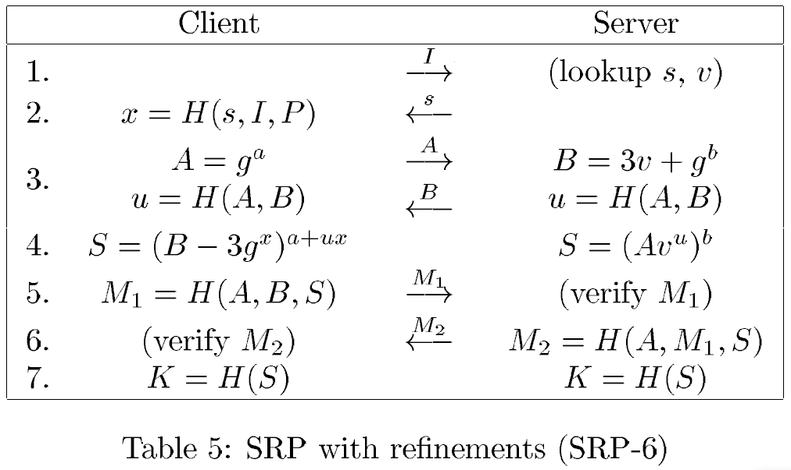
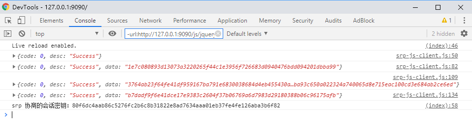

# SRP6 协议示例

### 0x01 概述

本 Demo 展示了 SRP 协议通信的过程，客户端使用 Javascript，服务端使用 Java 实现。

客户端基于 [thinbus-srp-npm](https://github.com/simbo1905/thinbus-srp-npm) 进行修改，兼容了 Java 的 Bouncy Castle 库的实现。

客户端与服务端使用 json 格式进行数据交换，服务端使用 Spring Boot。

### 0x02 SRP 协议协商过程

### 0x03 快速启动

服务端启动 Spring Boot，直接运行 `./src/main/java/com.changhr.cloud.srp.SrpJsJavaApplication.java` 的 main 函数。

客户端代码位于 `./client/` 目录下，使用浏览器访问 `index.html`，打开浏览器控制台，会显示与服务端的交互过程。

